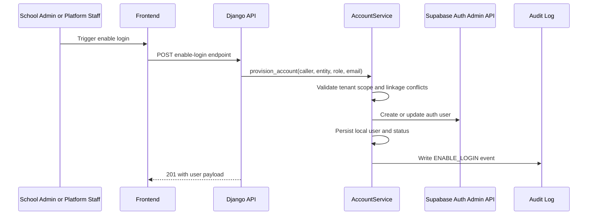
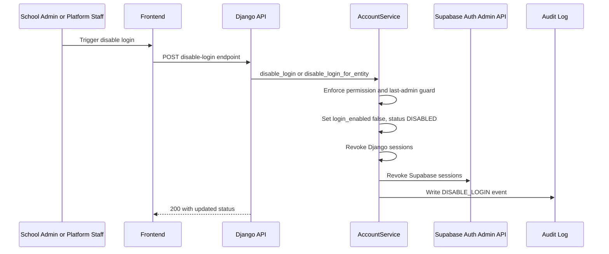
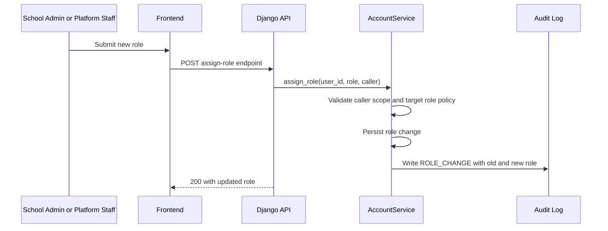
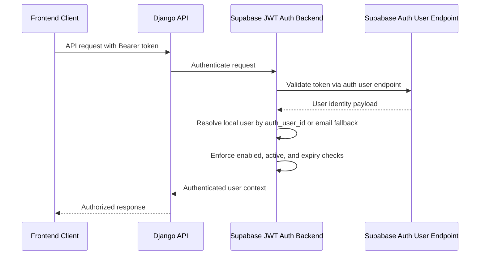

# Identity and Access Management Architecture

## Purpose and Scope
This document defines the Identity and Access Management (IAM) architecture for Academic Compass Kenya. It captures current implemented behavior and target operating contracts for identity lifecycle, access control, security auditing, and user-facing API behavior.

System boundaries:
- Supabase is the identity provider and session authority.
- Django is the domain authority for tenant-aware authorization, lifecycle policy enforcement, and auditability.
- Frontend clients call Django APIs and pass Supabase bearer tokens.

Out of scope:
- UI wireframes and UX specifications.
- Full threat model and compliance control mapping.
- Infrastructure-level hardening runbooks.

## 1) User Lifecycle
Account lifecycle states:
- NOT_ENABLED: Entity exists but no active login account is enabled for use.
- INVITED: Credentials or invitation issued; account expected to complete first login/password change.
- PENDING_EMAIL_VERIFICATION: Awaiting email verification where applicable.
- ACTIVE: Login enabled, account active, and allowed to access authorized APIs.
- DISABLED: Login blocked by administrative action.
- LOCKED: Login blocked due to security policy or administrative lock condition.
- EXPIRED: Account validity period ended.

Lifecycle triggers:
- Provision/enable login: creates or updates an IAM account mapped to an entity and can send invite.
- First login completion: clears force-change requirement after password update.
- Disable login: deactivates account and revokes active sessions.
- Expiry enforcement: either scheduled or request-time checks set EXPIRED and deny access.
- Delete user: removes account where policy allows.

Lifecycle protections:
- Last active school administrator protection prevents disabling, expiring, or deleting the final school admin for a school.
- Tenant checks ensure school-scoped operators cannot manage accounts outside their school.

## 2) Entity Linkage
Identity linkage model:
- IAM accounts are linked to business entities using entity_type plus entity_id on the User record.
- Supported entity types include teacher, staff, student, parent, and external_contact.
- School-level accounts are associated with school_id for tenant boundary enforcement.

Linkage principles:
- One account should represent one linked business entity at a time.
- Linkage is enforced in service-level provisioning workflows with conflict handling for already-linked entities.
- Email remains the primary user-facing identity key; auth_user_id links Django users to Supabase Auth users.

## 3) Authentication
Primary authentication flow:
1. Client authenticates with Supabase and receives access token.
2. Client sends Bearer token to Django APIs.
3. Django authentication backend validates token through Supabase /auth/v1/user.
4. Backend resolves local user by auth_user_id, with controlled email fallback when linking is missing.
5. Backend applies login gates before request is authorized.

Login gates:
- Deny if login_enabled is false.
- Deny if is_active is false.
- Deny if account is expired (and update local state to EXPIRED where policy applies).
- Deny if no linked Django user exists for authenticated Supabase identity.

Resilience behavior:
- If Supabase validation is unreachable, authentication can fall through to configured alternate backends; protected endpoints still require successful authentication.

## 4) Authorization
Authorization model:
- Role-aware and tenant-aware authorization is enforced primarily in Django service layer operations.
- Platform staff (global scope) can manage platform-level and cross-tenant operations as permitted.
- School administrators (tenant scope) can manage users within their own school only.

Authorization controls:
- Service-level permission validation is the canonical enforcement point for management actions.
- School isolation is enforced using caller school_id versus target school_id checks.
- Last-admin guard is treated as a hard business-policy control, not optional UI behavior.

Supabase-side authorization support:
- Supabase user_roles and RLS policies support platform console scope enforcement.
- Security-definer functions provide scoped access profiles for platform operations.

## 5) Supabase Responsibilities
Supabase owns:
- Authentication credentials and session issuance.
- Token introspection endpoint used by Django authentication bridge.
- Admin user creation and update operations used by backend/edge workflows.
- Role storage and RLS enforcement for Supabase-hosted platform console datasets.

Supabase does not own:
- School-level domain authorization decisions for Django APIs.
- Last-admin business constraints.
- Full lifecycle audit semantics for Django domain actions.

Integration responsibilities:
- Django stores auth_user_id as the durable cross-system identity pointer.
- Session revocation is triggered from Django workflows using Supabase admin capabilities where configured.

## 6) Email Responsibilities
Email delivery responsibilities are split to preserve reliability and auditability:

Django responsibilities:
- Sends branded welcome, resend, and reset communications in account service workflows.
- Sets force_password_change and lifecycle status updates when temporary credentials are issued.
- Logs account actions regardless of email send outcome where policy requires non-blocking behavior.

Supabase responsibilities:
- Can send invite/recovery emails through Auth endpoints where that mode is selected.
- Owns email verification mechanics tied to Supabase Auth state.

Delivery principle:
- Email delivery must not silently bypass authorization or lifecycle policy checks.
- Non-blocking email queue/dispatch failures should be logged for follow-up.

## 7) Audit Logging
Audit objectives:
- Provide forensic traceability for all high-impact IAM operations.
- Capture who performed an action, what changed, and in which tenant scope.

Required IAM audit event families:
- ENABLE_LOGIN
- DISABLE_LOGIN
- ROLE_CHANGE
- PASSWORD_RESET
- INVITE_SENT
- ACCOUNT_EXPIRED
- ACCOUNT_DELETED (where implemented)

Minimum audit payload:
- actor_user_id
- target_user_id
- school_id (nullable for platform users)
- action
- timestamp
- metadata (old/new role, entity link context, error context if relevant)

Audit invariants:
- Sensitive account changes must generate exactly one authoritative audit record in the primary audit path.
- API conflict/denial outcomes should still be operationally observable through logs/monitoring.

## 8) Login History
Login history model:
- LoginHistory stores login_time, optional logout_time, ip_address, user_agent, successful flag, and failure_reason.
- Entries are associated to User and ordered by newest first.

Capture behavior:
- Successful authentication activity is recorded from current-user access flow with a duplicate-control heuristic.
- Intended usage includes administrative visibility into sign-in patterns and incident response support.

Design considerations:
- Failed login event capture should be expanded and standardized across all auth denial paths for complete security telemetry.
- Retention policy should be configured to balance compliance and storage cost.

## 9) Password Lifecycle
Password lifecycle policies:
- Temporary passwords may be generated during provisioning, reset, or resend operations.
- force_password_change is set when temporary credentials are issued.
- First-login completion endpoint is used to finalize initial credential hygiene.

Reset and resend paths:
- Reset password flow updates Supabase credentials and marks account state for forced change.
- Resend login details can reissue temporary access details while preserving tenant and role constraints.

Security posture:
- Password handling logic is centralized in service workflows, not UI components.
- Null/invalid local password values are safely handled in fallback backend paths to avoid runtime exceptions.

## 10) API Design
IAM API surface (Django):
- GET /api/users/me/
- POST /api/users/me/complete-first-login/
- GET /api/users/
- POST /api/users/enable-login/
- POST /api/users/teachers/{entity_id}/enable-login/
- POST /api/users/staff/{entity_id}/enable-login/
- POST /api/users/external-contacts/{entity_id}/enable-login/
- POST /api/users/{user_id}/disable-login/
- POST /api/users/teachers/{entity_id}/disable-login/
- POST /api/users/staff/{entity_id}/disable-login/
- POST /api/users/external-contacts/{entity_id}/disable-login/
- POST /api/users/{user_id}/assign-role/
- POST /api/users/{user_id}/reset-password/
- POST /api/users/{user_id}/resend-login/
- GET /api/users/{user_id}/login-history/
- DELETE /api/users/{user_id}/

Design contracts:
- Tenant-aware list behavior: school admins see only users in their school; platform staff use platform scope.
- Dedicated endpoints are used for disable and role assignment to avoid overloading enable-login semantics.
- Conflict semantics:
  - 409 when entity is already linked to an account.
  - 409 when attempting to disable the last active school admin.
- Not found semantics:
  - 404 for missing target user or missing linked account (resource-dependent).
- Validation semantics:
  - 400 for invalid payloads or business-rule violations.

Idempotency and consistency:
- Provisioning operations should be safe against duplicate requests using entity-link conflict checks.
- Service layer remains the source of truth for permission checks and side effects (Supabase sync, session revoke, audit).

## Operational Notes
- IAM changes should be validated with backend tests covering cross-tenant denial, linkage conflicts, role assignment, disable flows, and last-admin protection.
- Production observability should include audit logs, login history reports, and Supabase admin API error telemetry.

## 11) Critical Sequence Flows

### 11.1 Enable Login for Linked Entity

### 11.2 Disable Login by User or Entity

### 11.3 Assign Role

### 11.4 Request Authentication Path

## Related Documents
- Stakeholder summary: docs/architecture/identity-access-summary.md
- QA checklist: docs/architecture/identity-access-qa-checklist.md

## Revision Control
- Baseline version: 1.1
- Date: 2026-07-18
- Owner: Backend Architecture / Identity Domain
